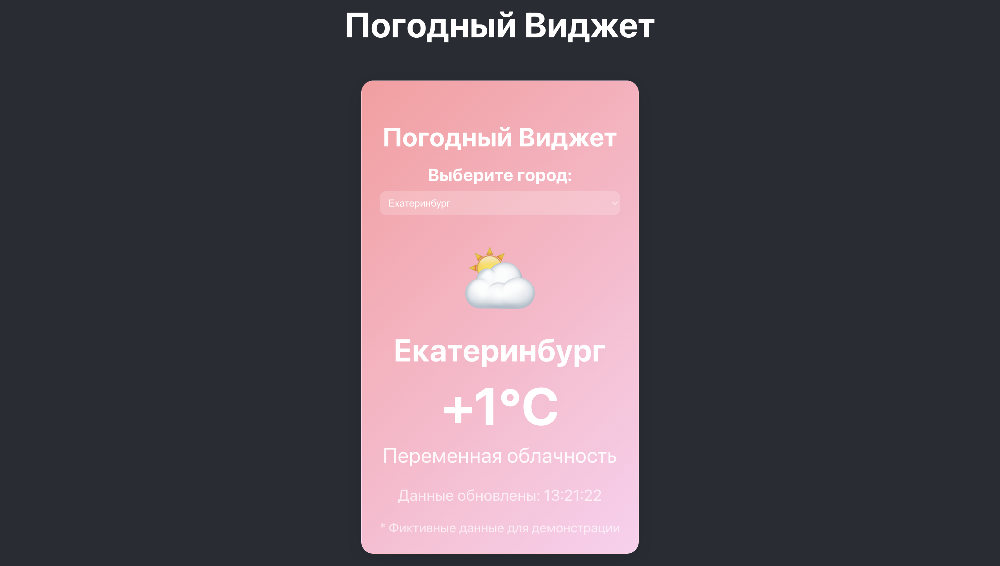
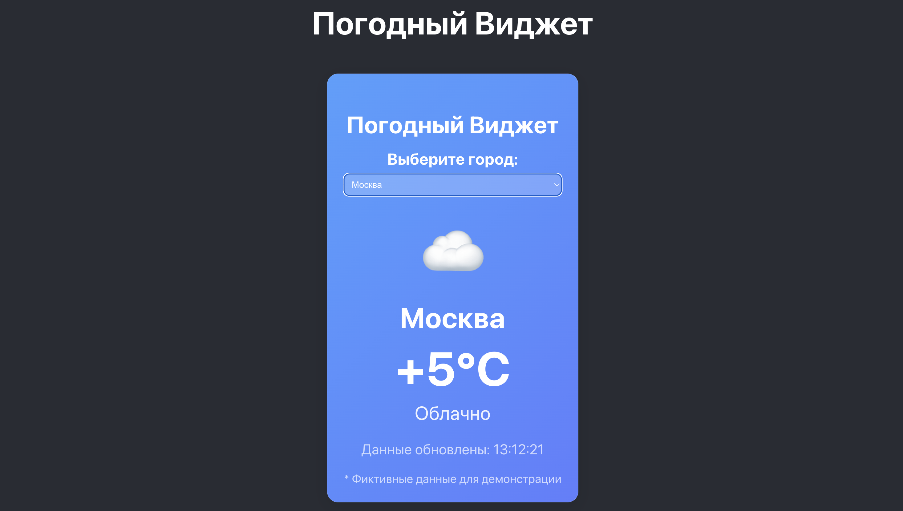
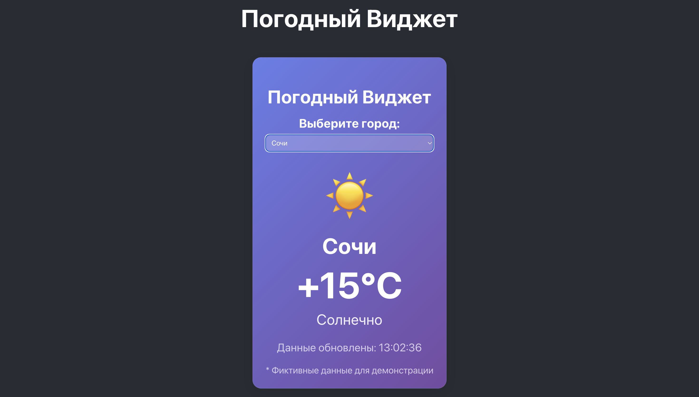
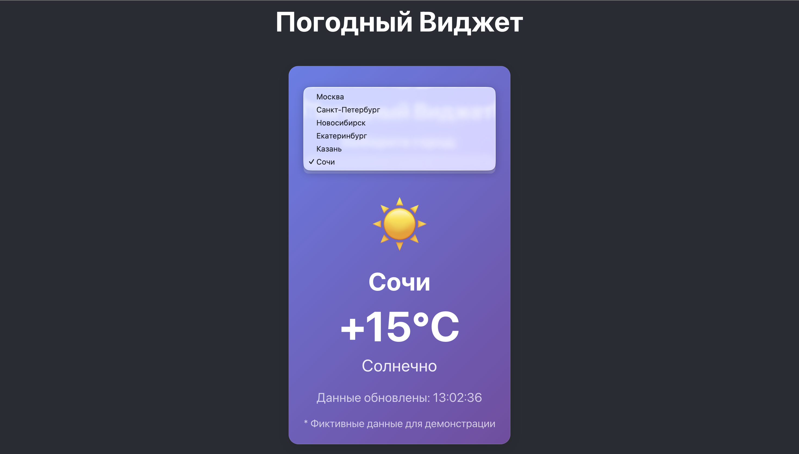

# Погодный Виджет
# Описание приложения
Погодный виджет - это React-приложение для отображения текущей погоды в различных городах. Приложение предоставляет актуальную информацию о температуре, погодных условиях, влажности и скорости ветра.

# Основные возможности
Выбор города из предустановленного списка
Отображение фиктивных данных о погоде
Визуальная адаптация - фон виджета меняется в зависимости от погодных условий

## 📸 Скриншоты

### Главный экран

### Разные города и погодные условия

### Выбор города из доступного списка 

